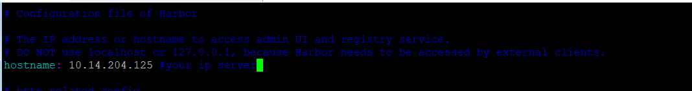
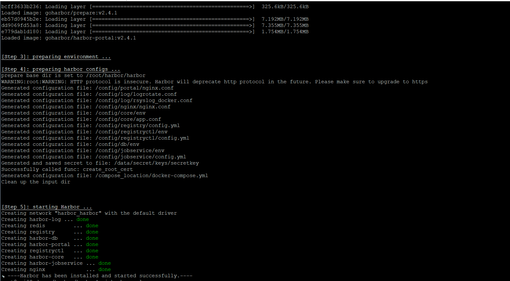
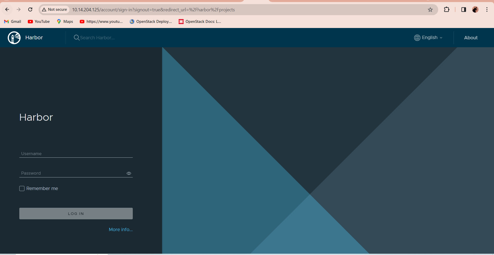
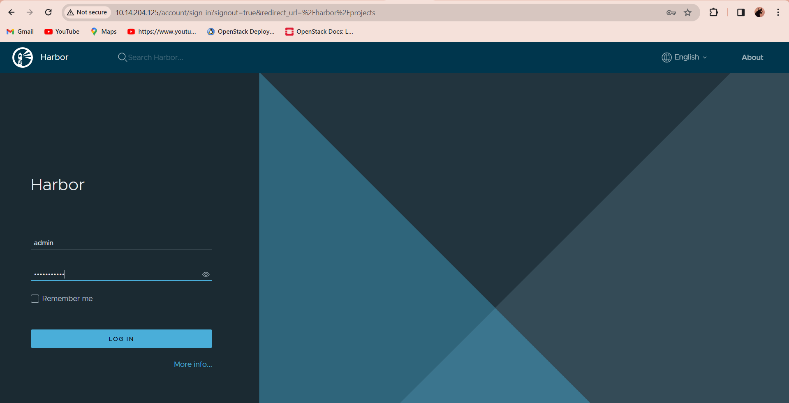
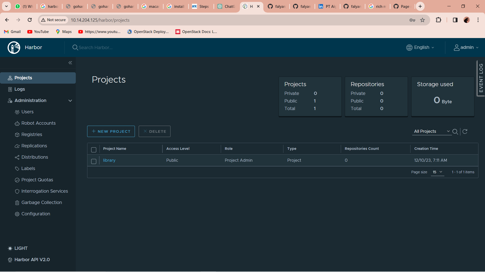

# How to install-harbor
Harbor for docker image registry

## Steps to Setup Harbor Image Registry on Ubuntu 20.04 LTS
### Step 1: Update the System.
```bash
apt-get update
```
## Step 2: Install Docker on System
- Install the required packages
```bash
apt install apt-transport-https ca-certificates curl software-properties-common
```
- Add GPG key
```bash
curl -fsSL https://download.docker.com/linux/ubuntu/gpg | sudo apt-key add -
```
- Add the Docker Repository
```bash
add-apt-repository "deb [arch=amd64] https://download.docker.com/linux/ubuntu focal stable"
```
- Update the packages
```bash
apt update
```
- install docker
```bash
apt install docker-ce
```
- check your docker
```bash
docker --version
```
```bash
systemctl daemon-reload
systemctl restart docker
```

## Step 3: Install Docker-compose on System
- Download & install docker compose
```bash
curl -L "https://github.com/docker/compose/releases/download/1.28.5/docker-compose-$(uname -s)-$(uname -m)" -o /usr/local/bin/docker-compose
```
- Provide the permission
```bash
chmod +x /usr/local/bin/docker-compose
```
- Check Docker compose version
```bash
docker-compose --version
```

## Step 4: install Harbor
- Download the Harbor on system
```bash
wget https://github.com/goharbor/harbor/releases/download/v2.4.1/harbor-offline-installer-v2.4.1.tgz
```

- Extract the downloaded folder
```bash
tar -xvzf harbor-offline-installer-v2.4.1.tgz
```
- Change the directory
```bash
cd harbor
```

- Copy the file
```bash
cp harbor.yml.tmpl harbor.yml
```
- Now,Open the harbor.yml file
```bash
vi harbor.yml
```
- Add the hostname

- Comments the following lines (this tutotial acces by local without SSL or public domain )

- Here,Default password of harbor web interface

- Step 6: Install Harbor on system
```bash
./install.sh
```
result:


## test acces your local ip from browser
- your harbor


- login into harbor default user is admin

result:


## 🔗 About me
[](https://www.linkedin.com/in/falyan-zuril-587585247/)